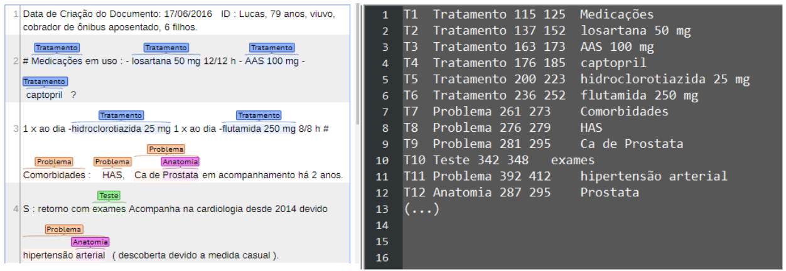
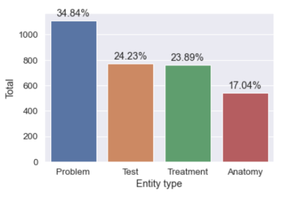
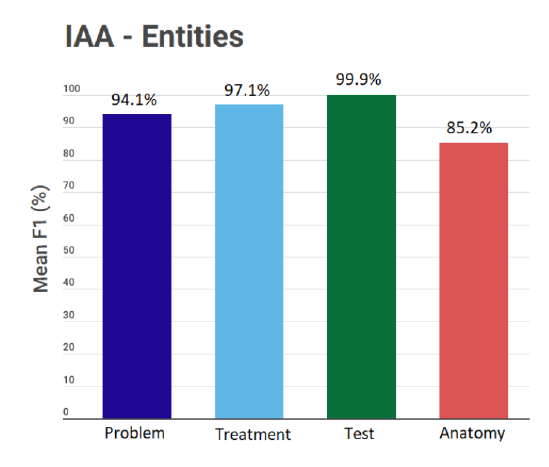

# NestedClinBr

NestedClinBr is a new corpus containing nested and discontinuous entities in Brazilian Portuguese clinical narratives.

The main goal of NestedClinBr is to provide a human-annotated corpus that can be used for learning and evaluating different machine learning models to extract valuable medical information in the Portuguese language, in special nested and discontinuous entities, an important but less explored task.

In the context of clinical NLP, the recognition of entities is commonly used for the identification of diseases, body parts, medications, and other relevant information, facilitating, for example, the detection of risk factors and medical decision-making. As NestedClinBr, although small, can contribute to the healthcare domain, it will be freely available to the research
community.

### Entities
Event types with their respective description and examples:

Entity type  | Definition  | UMLS group  | Examples (free translation)
--------- |--------- |--------- |--------- | 
Problem |Mentions that differ from normal expected conditions, including the location (body part), characterization, and severity, when available in the text. | Disorders | Injury, chest pain, SAH, severe dyspnea on exertion.
Treatment | Mentions relating to any procedure or intervention used to treat problems, including the dosage, in the case of drugs, and the location (body part), when available in the text. | Chemicals & Drugs, Devices, Procedures | Pacemaker, angioplasty, Enalapril 10 mg, mitral valve repair.
Test | Used to detect and evaluate problems (such as diagnostic procedures and physical examination), also including the location (body part), when available in the text. | Phenomena, Physiology | HDL, potassium, cardiac catheterization, myocardial scintigraphy.
Anatomy | Refers to body location, region, organ or organ component. | Anatomy | Heart valves, left hemithorax, mitral.

Percentage of entities:

### IAA - Inter-Annotator Agreement

The final IAA value for entity types was 94.08%, a high F1-measure that represents a substantial agreement between annotators. 

### Corpus Statistics
Number of documents, sentences, and tokens present in NestedClinBr:

| Type      | Training  | Test  | Total  |
|-----------|-----------|-------|--------|
| Documents | 100       | 26    | 126    |
| Sentences | 2,273     | 693   | 2,966  |
| Tokens    | 17,154    | 5,310 | 22,464 |

Statistics of the NestedClinBr corpus:

| Item      | Training   | Test      | Total     |
|-----------|------------|-----------|-----------|
|Problem |-|-|-|
| Nested    | 315 (72.92%) | 117 (27.08%) | 432     |
| Discontinuous | 80 (65.04%) | 43 (34.96%) | 123 |
| Total     | 1,110 (77.19%) | 328 (22.81%) | 1,438 |
| Entity avg. length | 2.6 | 2.5 | - |
|Treatment |-|-|-|
| Nested    | 50 (76.92%) | 15 (23.08%) | 65 |
| Discontinuous | 4 (100%) | 0 (0%) | 4 |
| Total     | 761 (78.05%) | 214 (21.95%) | 975 |
| Entity avg. length | 2.1 | 2.1 | - |
|Test |-|-|-|
| Nested    | 15 (71.43%) | 6 (28.57%) | 21 |
| Discontinuous | 0 (0%) | 0 (0%) | 0 |
| Total     | 772 (75.98%) | 244 (24.02%) | 1,016 |
| Entity avg. length | 1.2 | 1.3 | - |
|Anatomy |-|-|-|
| Nested    | 395 (75.38%) | 129 (24.62%) | 524 |
| Discontinuous | 5 (83.33%) | 1 (16.66%) | 6 |
| Total     | 543 (73.58%) | 195 (26.42%) | 738 |
| Entity avg. length | 1.4 | 1.3 | - |
|Overall |-|-|-|
| Nested    | 778 (74.45%) | 267 (25.55%) | 1,045 |
| Discontinuous | 89 (66.92%) | 44 (33.08%) | 133 |
| Total     | 3,186 (76.46%) | 981 (23.54%) | 4,167 |
| Percentage of entities vs ’O’ (balancing) | 30.8% | 30.1% | - |
| Entity avg. length | 1.9 | 1.9 | - |
| Max. tokens per sentence | 192 | 146 | - |

### How to download the corpus
** We are in the process of submitting the corpus to a journal, and we will soon make it available. **

### How to cite
*** soon *** 
